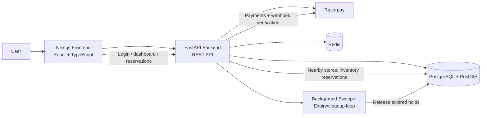
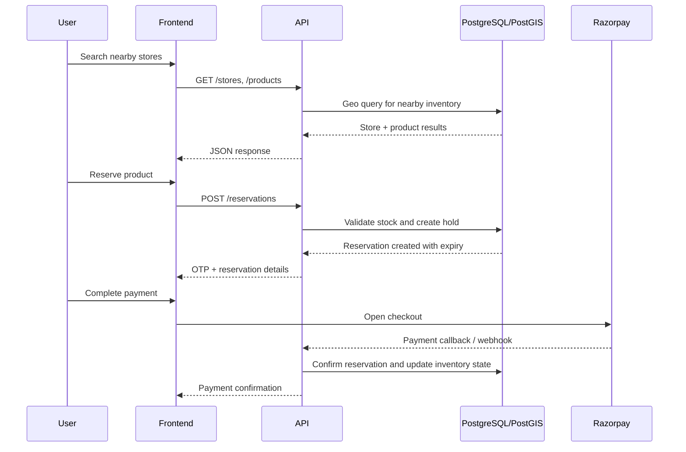

# Holdit-Razorpay

HoldIt is a geospatial inventory reservation system built for store-first product discovery and reservation flows. Users can find nearby stores, check real-time inventory, reserve products for a short window, and complete payment through Razorpay.

It is designed as a full-stack monorepo with a FastAPI backend and a Next.js frontend, backed by PostgreSQL with PostGIS for geospatial queries and a lightweight background expiry mechanism for reservations.

## Why this project

- Search nearby stores using location-aware queries
- Reserve products with a short hold window and OTP-based confirmation flow
- Support secure Razorpay checkout and signature verification
- Keep the app easy to run locally with Docker and safe development defaults

## Architecture



### Component responsibilities

- Frontend: Next.js app for browsing stores, checking stock, reserving products, and paying
- Backend: FastAPI endpoints for auth, store discovery, reservations, payments, and inventory rules
- Database: PostgreSQL with PostGIS for nearby-store and inventory queries
- Redis: cache and lightweight background task support
- Razorpay: payment collection and order verification

## Typical workflow



## Core application flow

1. User signs in or creates an account.
2. Frontend queries the backend for stores and product inventory near the user's location.
3. The backend runs geospatial SQL with PostGIS to find the nearest valid stores.
4. User reserves an item; the system creates a temporary hold and generates an OTP.
5. Payment is processed through Razorpay.
6. Reservation is confirmed or left to expire automatically if unpaid.
7. A background sweeper releases stale reservations back into available inventory.

## Repository structure

```text
.
├── backend/           # FastAPI app, models, services, routes
├── frontend/          # Next.js frontend app
├── docs/              # Architecture and workflow documentation
├── docker-compose.yml # Local development stack
├── docker-compose.prod.yml
├── README.md
├── AGENTS.md
└── package-lock.json
```

## Quick start

### Docker (recommended)

```bash
docker-compose up --build
```

Then open:

- Frontend: http://localhost:3000
- Backend API docs: http://localhost:8000/docs

### Manual setup

#### Backend

```bash
cd backend
pip install -r requirements.txt
alembic upgrade head
uvicorn main:app --reload --port 8000
```

#### Frontend

```bash
cd frontend
npm install
npm run dev
```

## Features

- Geospatial store discovery with PostGIS
- Real-time inventory checks and reservation holds
- OTP-based reservation flow
- Razorpay payment integration
- Docker-based local setup
- Clear backend/frontend separation for easier development

## Documentation

For deeper implementation details, see:

- docs/MICRO_ARCHITECTURE.md
- docs/WORKFLOW.md
- docs/API.md

## Notes

This project is intentionally set up for easy local development, with default safe mock values for local containers so you can get started quickly without a heavy custom environment setup.
